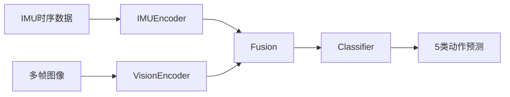

# 无人机动作预测

## 1、整体网络设计

整体采用一个LSTM + CNN + Transformer的混合架构

IMUEncoder(LSTM结构)用于处理IMU序列，获取IMU特征；VideoEncoder(CNN结构，采用MobileNet-v3)用于处理视觉的多帧，获取视觉特征，获取二者特征之后进行一次融合，经过Classifier分类器(Transformer结构)获取到最终结果，整体流程如下

视觉侧的采用MobileNet-V3 small作为骨干网络(backbone)，在性能与效率之间取得最佳的平衡。

## 2、数据集的准备

### 2.1 数据集构成

首先需要明确目标，需要构建一个多模态的固定翼无人机动作数据集，包含无人机的IMU状态以及视觉两个模态。由于当前固定翼无人机的多模态数据非常少，但是旋翼无人机的多模态数据集比较容易获得。因此我们通过对现有的旋翼无人机多模态数据集的视觉部分，抽取出每一个动作的光流图作为视觉模块，与已有的固定翼无人机数据集结合，手工mock出一个固定翼无人机的数据集。

用于抽取光流的旋翼无人机数据集主要采用**[drone-racing-dataset](https://github.com/tii-racing/drone-racing-dataset)**数据集。通过无人机在多个轨迹下飞行采集到的IMU数据与相机数据构造的数据集，数据集本身不包含无人机的具体动作，但是可以通过其它的参数大致推导出无人机当前的姿态。

数据集中无人机采集信息的频率为500Hz(即每秒500条数据)，我们采用750样本点(1.5s)作为一个动作窗口，通过固定的规则判断无人机当前的动作信息。然后对于这个窗口中的首尾两帧数据抽取出运动中的光流图作为视觉数据。

构造好旋翼无人机的数据后。我们结合已有的固定翼无人机数据(只包含IMU数据，包含六个动作类别，上升、下降、平飞、左转弯、右转弯，盘旋，每个动作每条数据包含150个样本点，每个样本点22个IMU状态)，将抽好的不同动作的光流图随机匹配到对应动作的数据中，构造出一条多模态数据(选择光流作为视觉数据来避免无关背景对于预测的影响，使得模型能够更加关注于不同动作带来的视觉**变化**)。

最终的多模态数据包含六类动作，分布如下：

1. 上升 701
2. 下降 434
3. 右转弯 834
4. 左转弯 685
5. 平飞 2016
6. 盘旋 2088

我们从中抽取100条作为测试集，评估模型的准确率。

## 3、训练设置

训练采用小批量梯度下降的优化方法，batch size为64，采用AdamW优化器。

初始学习率为1e-3，学习率调整策略采用余弦退火 + Warmup策略，warmup 1000步(可以调整)，一共50个Epoch

下图为对应的学习率调整策略：

## 4、实验

